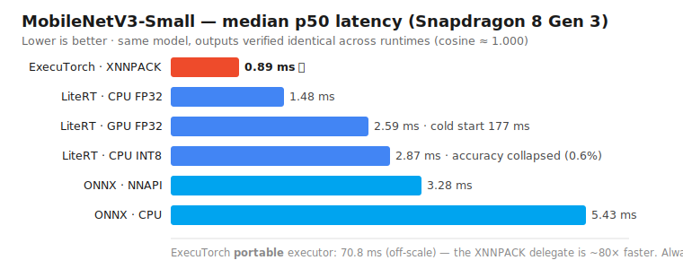

# Android AI Benchmark — On-Device Inference Runtime Comparison

> **Does GPU always beat CPU? Does INT8 always beat FP32?**  
> We measured it on a real device. The answers might surprise you.

[](https://developer.android.com)
[](https://kotlinlang.org)
[](LICENSE)
[](https://github.com/sangsoolee/android-edge-ai-benchmark-lab/actions)

---

<p align="center">
  
</p>

## TL;DR — what surprised me in 30 seconds

- 🏆 **Fastest is ExecuTorch + XNNPACK (0.89 ms)**, narrowly beating LiteRT. *And I was wrong about ExecuTorch at first* — I'd measured it at 70 ms ("44× slower") because a **stale portable `.pte` was still on the device**. Verifying the on-device artifact flipped the conclusion. ([details](#what-we-found-galaxy-s26-ultra--snapdragon-8-gen-3))
- ❌ **INT8 is not free** — full-integer PTQ **collapsed** MobileNetV3-Small accuracy from 69.4% → **0.6%** (and ran *slower*). FP16 preserved accuracy at half the size.
- 🔀 **"Turn on the NPU" isn't portable advice** — ONNX NNAPI *helped* on Snapdragon (−40%) but was *slower* than CPU on Exynos. ([matrix](#cross-device-snapdragon-vs-exynos))
- 📐 **Inference-only numbers mislead** — on YOLOv8n, INT8 is 3.1× faster on inference but only **2.25× end-to-end** once you count quantize/dequant in pre/post.
- ✅ **Reproducible** — release builds, p50/p95/p99, raw CSVs committed, outputs verified identical across runtimes (cosine ≈ 1.000).

<p align="center">
  
</p>

---

## What We Found (Galaxy S26 Ultra · Snapdragon 8 Gen 3)

### MobileNetV3-Small — All Runtimes

| Runtime | Backend | Precision | Model Size | p50 | p95 | p99 | Cold Start | Memory |
|---|---|---|---:|---:|---:|---:|---:|---:|
| **ExecuTorch** | **CPU (XNNPACK)** | **FP32** | 9.73 MB | **0.89 ms** 🏆 | 1.06 ms | 1.15 ms | 16 ms | 116 MB |
| LiteRT | CPU (XNNPACK) | FP32 | 9.73 MB | 1.48 ms | 1.54 ms | 1.56 ms | 24 ms | 95 MB |
| LiteRT | GPU delegate | FP32 | 9.73 MB | 2.59 ms | 3.11 ms | 3.37 ms | 177 ms | 186 MB |
| LiteRT | CPU (XNNPACK) | INT8 | 2.76 MB | 2.87 ms | 3.16 ms | 3.64 ms | 18 ms | 100 MB |
| ONNX Runtime | NNAPI | FP32 | 9.71 MB | 3.28 ms | 5.58 ms | 5.73 ms | 39 ms | 143 MB |
| ONNX Runtime | CPU | FP32 | 9.71 MB | 5.43 ms | 5.59 ms | 5.74 ms | 44 ms | 147 MB |
| ExecuTorch | CPU (**portable**) | FP32 | 9.84 MB | 70.8 ms | 72.5 ms | 72.8 ms | 93 ms | 138 MB |

> Measurement: warmup=20, measured=100 runs · **median of 5 sessions** · release build · airplane mode · no charging · 5-min cooldown · fixed-seed synthetic input (outputs verified identical across runtimes — see below)

### MobileNetV3-Small — FP32 vs INT8 Accuracy (ImageNet validation, n=500)

| Runtime | Precision | Quantization | Top-1 | Top-5 | Top-1 Drop | Result |
|---|---|---|---:|---:|---:|---|
| LiteRT / TFLite | FP32 | none | **69.4%** | 88.6% | — | ✅ Valid baseline |
| LiteRT / TFLite | **FP16** | weight fp16 | **69.6%** | 88.6% | **+0.2 pp** | ✅ Safe compression |
| LiteRT / TFLite | INT8 | full-integer PTQ | **0.6%** | 1.6% | **−68.8 pp** | ❌ Accuracy collapse |

**This is a measured negative finding, not an eval bug.** FP32 reaching 69.4% (vs MobileNetV3-Small's official 67.7%) confirms preprocessing and label mapping are correct; the same manifest, preprocessing, and dtype detection were used across precisions. *In this setup*, naive full-integer INT8 PTQ collapsed accuracy (Top-5 fell too: 88.6% → 1.6%) while only shrinking the model. **FP16 is the safe middle option** — it preserves accuracy (no retraining) at ~half the size. See [results/accuracy/README.md](results/accuracy/README.md) for sanity checks, likely causes, and the QAT feasibility study.

**Latency × size × accuracy — the actual decision:**

| Precision | Size | p50 latency | Memory | Top-1 | Decision |
|---|---:|---:|---:|---:|---|
| FP32 | 9.73 MB | 1.53 ms | ~100 MB | 69.4% | ✅ Selected |
| FP16 | 4.89 MB | — | ~100 MB | 69.6% | ✅ Safe compression |
| INT8 (full-integer) | 2.76 MB | 2.86 ms | ~100 MB | 0.6% | ❌ Rejected |

> INT8 was 3.5× smaller but **slower** (dequantize overhead on this chip) **and** accuracy-collapsed — rejected despite the size win. FP16 halves the size with no accuracy loss. **Edge optimization must be measured across latency, memory, size, *and* accuracy together** — size/latency alone can hide a broken model.

**QAT feasibility (v0.4.1b).** Can Quantization-Aware Training recover the collapsed INT8? Two findings: (1) TFMOT's `quantize_model` **does not support MobileNetV3** (custom hard-swish / SE) — so MobileNetV3 is hostile to quantization at *both* the PTQ and QAT-tooling levels. (2) On a quantization-friendly arch (Keras MobileNetV2, FP32 sanity 72.6%), the QAT toolchain runs end-to-end and produces a **non-collapsed** INT8, but a 500-image / 1-epoch PoC only reached **16.6% Top-1** — far short of recovery.

> ⚠️ The QAT PoC used the **same 500 images for fine-tune and eval** (no train/eval split), so 16.6% is an optimistic upper bound — and it was still low, confirming the PoC training budget was insufficient. This is a **toolchain-feasibility check, not an apples-to-apples recovery** of the MobileNetV3 baseline (different architecture/weights). **Conclusion: FP16 is the practical recovery path here; proper QAT needs a real train/eval split + training budget → future work.**

**Key findings:**
- 🏆 **ExecuTorch with the XNNPACK delegate is fastest (0.89 ms)**, narrowly ahead of LiteRT CPU (1.48 ms) — both run XNNPACK kernels. All runtimes produce identical outputs (cosine ≈ 1.000), so the gaps are pure runtime efficiency.
- 🔁 **Correction (and the best lesson here):** an earlier version of this README reported ExecuTorch as "44× slower / XNNPACK didn't help (74 ms)." That was wrong — it measured the **portable executor** (and a *stale* portable `.pte` left on the device). With the XNNPACK-lowered `.pte` actually on-device, ExecuTorch drops from **70.8 ms (portable) → 0.89 ms (XNNPACK)**. Lesson: *verify the artifact that's actually on the device.*
- ⚡ **ONNX NNAPI beats ONNX CPU by ~40% on Snapdragon (5.43 → 3.28 ms)** — but the distribution is bimodal (NNAPI partially falls back for hard-swish), and **on Exynos NNAPI is *slower* than its own CPU path** (see cross-device matrix). NNAPI's value is vendor-dependent.
- ⚠️ **GPU cold start ≈ 177 ms** — ~10× the CPU path (shader compilation). Critical for first-launch UX; and GPU p50 (2.59 ms) loses to CPU on this small model.
- ⚠️ **INT8 is ~2× slower than FP32 on CPU (1.48 → 2.87 ms)** for this classifier — dequantize ops outweigh compute savings; INT8's only win here is 3.5× smaller on disk (and on YOLOv8n INT8 is *faster* — see below).

*The "fair tier" lesson: enabling each runtime's accelerator (NNAPI, XNNPACK) did **not** universally close the gap — it helped ONNX modestly and didn't help ExecuTorch at all on this build. "GPU is faster", "INT8 is faster", "this accelerator is faster" are not universal truths — always benchmark on your target device.*

### YOLOv8n — Object Detection (inference-only latency)

640×640 input, same protocol (median of 5). **Inference only** — preprocess (letterbox) and postprocess (NMS) are split out separately in v0.5.2–0.5.3.

| Runtime | Backend | Precision | Size | p50 | p95 | p99 | Cold Start | Memory |
|---|---|---|---:|---:|---:|---:|---:|---:|
| LiteRT | CPU (XNNPACK) | FP32 | 12.28 MB | 87.9 ms | 89.0 ms | 89.5 ms | 116 ms | 159 MB |
| LiteRT | CPU (XNNPACK) | INT8 | 3.27 MB | **27.0 ms** | 27.5 ms | 27.6 ms | 51 ms | 146 MB |

**On YOLOv8n, INT8 is 3.3× faster *and* 3.75× smaller — the opposite of MobileNetV3-Small, where INT8 was *slower*.** On the heavy 640×640 detector the INT8 compute savings dominate; on the tiny classifier the dequantize overhead outweighed them. INT8's benefit is a function of the **compute-to-overhead ratio**, not a universal rule.

> ⚠️ Latency only — **YOLOv8n INT8 detection accuracy (mAP) is not yet verified.** After the MobileNetV3 INT8 collapse, a *fast* INT8 model is not automatically a *correct* one; mAP validation is future work.

### YOLOv8n — Detection postprocess (Python ↔ Android parity)

The full detection pipeline (letterbox → inference → decode → class-aware NMS) runs on-device and is verified against the Python reference on the same image:

<p align="center">
  
</p>

| | Python (reference) | Android (on-device) |
|---|---|---|
| detections | 4 person + 1 bus | 4 person + 1 bus |
| score Δ | — | ≤ 0.006 |
| box Δ | — | ≤ ~4 px (bus ~10 px, 1.3%) |

Identical class IDs, count, and order; the sub-percent box differences trace to the bilinear-resize implementation (Android `createScaledBitmap` vs PIL), not the postprocess logic. Reproduce: [`scripts/eval/yolo_detect_reference.py`](scripts/eval/yolo_detect_reference.py) (Python) and the app's **Detect Sample** button (Android).

### YOLOv8n — 3-phase latency breakdown (FP32 vs INT8)

Same image, 640×640, LiteRT CPU, median of 100 (warmup 20). Each phase is timed separately; **end-to-end has its own outer timer** (so its p50 ≠ the sum of phase p50s). Preprocess includes the INT8 input quantization; postprocess includes the INT8 output dequant. Rendering is excluded.

| Precision | Preprocess | Inference | Postprocess | End-to-End | Size | Peak Mem |
|---|---:|---:|---:|---:|---:|---:|
| FP32 | 4.1 ms | 83.6 ms | 1.0 ms | **88.7 ms** | 12.28 MB | 198 MB |
| INT8 | 10.1 ms | **26.8 ms** | 2.5 ms | **39.3 ms** | 3.27 MB | 146 MB |

**The phase split changes the conclusion.** On inference alone INT8 is **3.1× faster** (83.6 → 26.8 ms). But it pays for that elsewhere: float→int8 **input quantization makes preprocess ~2.5× slower** (4.1 → 10.1 ms) and output dequant doubles postprocess. **End-to-end, INT8's lead shrinks to 2.25×** (88.7 → 39.3 ms) — still a clear win here, but an *inference-only* benchmark would have overstated it by ~40%.

> The preprocess penalty is partly a scalar float→int8 loop (optimizable with a vectorized/NEON path); the postprocess penalty is the output dequant. Either way the lesson holds: **quantization relocates cost into pre/post — measure every phase, not just inference.**

**v0.4 ↔ v0.5, the through-line:**
- MobileNetV3-Small: INT8 PTQ **collapsed accuracy and was slower** → rejected.
- YOLOv8n: INT8 is **genuinely faster end-to-end (2.25×)** — but less than inference-only implies.
- INT8's value is entirely **model-, runtime-, and phase-dependent.** There is no universal answer; you have to measure.

---

## Cross-device: Snapdragon vs Exynos

Same APK, same models, same protocol on two chips — **Galaxy S26 Ultra (Snapdragon 8 Gen 3, Adreno)** vs **Galaxy S24 (SM-S947B, Exynos 2400, Xclipse 940)**. Median p50 (ms), MobileNetV3-Small unless noted.

| Runtime / Backend | Precision | Snapdragon 8 Gen 3 | Exynos 2400 | Notes |
|---|---|---:|---:|---|
| ExecuTorch CPU (XNNPACK) | FP32 | **0.89** | **1.13** | fastest on both |
| LiteRT CPU (XNNPACK) | FP32 | 1.48 | 1.67 | |
| LiteRT CPU (XNNPACK) | INT8 | 2.87 | 2.71 | Exynos slightly faster |
| LiteRT GPU delegate | FP32 | 2.59 | 3.18 | cold start ~177–182 ms both |
| ONNX Runtime CPU | FP32 | 5.43 | **3.39** | Exynos CPU faster |
| ONNX Runtime NNAPI | FP32 | **3.28** | 4.95 | **opposite verdict per chip** |
| LiteRT CPU — YOLOv8n | FP32 | 87.9 | 142.9 | Snapdragon faster on the heavy model |
| LiteRT CPU — YOLOv8n | INT8 | 27.0 | 38.5 | INT8 wins on both |

**Cross-device findings:**
- 🔀 **NNAPI flips per vendor.** On Snapdragon, ONNX NNAPI beats its CPU path (5.43 → 3.28 ms). On Exynos, NNAPI is *slower* than its own CPU (3.39 → 4.95 ms). "Enable the NPU" is not portable advice.
- 🟢 **Exynos is faster on small CPU paths** (ONNX CPU 3.39 vs 5.43), **slower on the heavy YOLOv8n** (142.9 vs 87.9 ms). Chip strengths are workload-dependent.
- 🧠 **Exynos uses notably more memory** (ExecuTorch peak 207 vs 116 MB; ONNX 211 vs 147 MB).
- ✅ **The fastest config (ExecuTorch XNNPACK) and the INT8-helps-YOLO finding hold on both chips** — but the *runner-up ordering* does not. "Fastest runtime" is a per-device question; the pipeline groups results by `device_model` so a third phone is a measure-and-drop-in.

---

## What This Project Is

A **reproducible benchmarking pipeline** for comparing on-device AI inference runtimes on real Android hardware.

Most "on-device AI" articles benchmark on a simulator, use a single average latency number, or don't disclose measurement conditions. This project measures **p50/p95/p99 latency, cold-start time, peak PSS memory, and thermal status**, documents the exact measurement protocol, and commits the raw result rows — every benchmark run, including repeat sessions — to [results/raw/](results/raw/). (Each row aggregates one 100-inference run; committing the full per-inference distributions is planned — see `docs`/roadmap.)

**Runtimes compared:**

| Runtime | Status | Backends |
|---|---|---|
| [LiteRT / TFLite](https://ai.google.dev/edge/litert) 2.x | ✅ v0.1 | CPU (XNNPACK), GPU delegate |
| [ONNX Runtime Android](https://onnxruntime.ai) 1.x | ✅ v0.2 | CPU, NNAPI |
| [ExecuTorch](https://pytorch.org/executorch) 1.x | ✅ v0.3 | CPU (portable / XNNPACK-lowered) |

---

## Reproducibility First

Measurement conditions are documented and **partially recorded in code**. The app automatically controls and captures the warmup/measured loops, cold-start, thermal status, and peak memory. The remaining conditions (airplane mode, brightness, charging, cooldown) are a **manual protocol the experimenter must follow** — they are not enforced by the app.

```
Recorded / enforced in code:
  Warmup runs:    20 (discarded)
  Measured runs:  100
  Input:          Fixed input tensor, identical every run
  Cold start:     model load + first inference
  Thermal:        PowerManager status before/after
  Peak memory:    PSS polling during measured loop

Manual protocol (experimenter-controlled, not enforced):
  Build type:     Release (never debug — interpreter overhead is significant)
  ABI:            arm64-v8a only
  Network:        Airplane mode ON
  Screen:         50% brightness, fixed
  Charging:       Cable disconnected
  Cooldown:       5 min idle before each session
```

### Fair-tier comparison & correctness

Beyond the default CPU path, each runtime is measured with its on-device accelerator where available (LiteRT GPU delegate, ONNX NNAPI, ExecuTorch XNNPACK lowering). Before comparing latency, the three runtimes are verified to compute the **same** model: one fixed-seed input yields matching logits (cosine ≈ 1.000, identical top-1) — see [`scripts/eval/cross_runtime_check.py`](scripts/eval/cross_runtime_check.py). This ensures latency gaps reflect runtime efficiency, not divergent conversions.

### Why p99?

p50 looks great on a chart. p99 is what your users actually experience on a bad thermal day.  
A runtime with `p50=12ms` but `p99=180ms` is not production-ready.

> **Percentile definition:** computed as floor-index nearest-rank — `sorted[floor(p/100 · (n-1))]`. With `n=100`, p99 maps to index 98 (the 99th of 100 sorted samples), i.e. effectively the near-maximum rather than an interpolated value.

---

## How to Reproduce

### Step 1 — Python environment

```bash
cd android-edge-ai-benchmark-lab

python3 -m venv .venv-convert
source .venv-convert/bin/activate       # Windows: .venv-convert\Scripts\activate

pip install --upgrade pip setuptools wheel
pip install cmake ninja
pip install -r scripts/convert/requirements.txt
pip install tf-keras
```

> The conversion stack (`torch` + `tensorflow` + `onnx2tf`) has conflicting version constraints. A dedicated venv is required.

### Step 2 — Convert models

```bash
# TFLite (LiteRT)
python scripts/convert/export_tflite.py --model mobilenet_v3_small --precision fp32
# INT8 with random calibration (fast)
python scripts/convert/export_tflite.py --model mobilenet_v3_small --precision int8
# INT8 with real ImageNet calibration (better accuracy, requires dataset)
python scripts/convert/export_tflite.py --model mobilenet_v3_small --precision int8 \
  --representative-data /path/to/imagenet/val --representative-samples 500

# ONNX
python scripts/convert/export_onnx.py --model mobilenet_v3_small --precision fp32

# ExecuTorch
python scripts/convert/export_executorch.py --model mobilenet_v3_small --precision fp32

# TorchAO INT8 (alternative quantization pipeline)
python scripts/convert/export_torchao.py --model mobilenet_v3_small
```

### Step 3 — Build, install, launch once

```bash
./gradlew assembleRelease
adb install -r app/build/outputs/apk/release/app-release.apk
# Launch once so the APP creates app-owned models/ samples/ results/ dirs.
adb shell monkey -p com.edgeai.benchmark -c android.intent.category.LAUNCHER 1
```

> ⚠️ **Do not `adb shell mkdir` the `models/` dir.** It would be owned by `shell`,
> and the app (a different uid) gets `canRead=false` on it — so models look
> "missing" even when the files are present. The app creates app-owned dirs on
> launch; push files into those.

### Step 4 — Push models & sample image

```bash
# Push CONTENTS into the app-created dir ('models/.' avoids a nested models/models/)
adb push models/. /sdcard/Android/data/com.edgeai.benchmark/files/models/
# Detection sample (any image; e.g. ultralytics' bus.jpg)
adb push sample.jpg /sdcard/Android/data/com.edgeai.benchmark/files/samples/sample.jpg
```

### Step 5 — Run & pull results

Run the app → select runtime/model/backend/precision → **Run Benchmark**

```bash
# Pull results. Note: adb nests them under results/raw/results/ — move the CSV
# up to results/raw/ (the committed location the analyze scripts expect).
adb pull /sdcard/Android/data/com.edgeai.benchmark/files/results/ ./results/raw/
mv ./results/raw/results/*.csv ./results/raw/ 2>/dev/null || true
```

### Step 6 — Analyze

```bash
# Charts (latency / memory / cold-start)
python scripts/analyze/plot_results.py \
  --input results/raw/ \
  --output results/graphs/

# Per-configuration summary table
python scripts/analyze/parse_results.py \
  --input results/raw/ \
  --markdown

# FP32 vs INT8 accuracy (requires ImageNet validation set)
# Step A: build manifest from Kaggle download
python scripts/eval/prepare_imagenet_val.py \
  --val-images-dir /path/to/ILSVRC/Data/CLS-LOC/val \
  --solution-csv   /path/to/LOC_val_solution.csv \
  --output-dir     data/imagenet

# Step B: evaluate each model (smoke test: --limit 500)
python scripts/eval/accuracy_eval.py \
  --model models/mobilenet_v3_small_fp32.tflite \
  --manifest data/imagenet/val_manifest.csv \
  --limit 5000

python scripts/eval/accuracy_eval.py \
  --model models/mobilenet_v3_small_int8.tflite \
  --manifest data/imagenet/val_manifest.csv \
  --limit 5000

# Step C: compare and generate report
python scripts/eval/compare_accuracy.py \
  --fp32 results/accuracy/mobilenet_v3_small_fp32_results.json \
  --int8 results/accuracy/mobilenet_v3_small_int8_results.json
```

---

## Project Structure

```
android-edge-ai-benchmark-lab/
├── app/src/main/kotlin/com/edgeai/benchmark/
│   ├── benchmark/        # BenchmarkEngine (abstract) + LiteRtEngine / OnnxEngine / ExecuTorchEngine
│   ├── model/            # BenchmarkResult data class, Runtime/Backend/Precision enums
│   ├── ui/               # MainActivity, ResultsAdapter
│   └── util/             # ThermalMonitor, MemoryTracker, CsvExporter
├── scripts/
│   ├── convert/          # PyTorch → ONNX / TFLite / ExecuTorch / TorchAO
│   ├── eval/             # Accuracy evaluation pipeline (prepare → eval → compare)
│   └── analyze/          # CSV → latency/memory charts (matplotlib / seaborn)
├── results/
│   ├── raw/              # Raw CSV from device (git-ignored)
│   ├── graphs/           # Generated charts (git-ignored)
│   └── accuracy/         # FP32 vs INT8 accuracy results and report
├── data/                 # ImageNet val dataset (git-ignored — large)
└── docs/                 # Screenshots, write-ups
```

---

## Device Matrix

The analysis pipeline groups results by `device_model`, so adding a phone is a
measure-and-drop-in operation. "Best runtime" is a per-device question.

| Device | SoC | Android | Results |
|---|---|---|---|
| Samsung Galaxy S26 Ultra (SM-S948N) | Snapdragon 8 Gen 3 (Adreno) | Android 16 | ✅ [data](results/raw/) |
| Samsung SM-S947B | Exynos 2400 (Xclipse 940) | Android 16 | ✅ [data](results/raw/) |

---

## Write-up

📝 **[What I learned measuring AI inference runtimes on a real Android phone](docs/blog/01-on-device-inference-benchmark.md)** — the methodology and the findings (why "GPU/INT8/runtime X is faster" all broke under measurement).

---

## Roadmap

- [x] **v0.1** — LiteRT (CPU + GPU), MobileNetV3-Small, p50/p95/p99, CSV export
- [x] **v0.2** — ONNX Runtime CPU, LiteRT vs ONNX Runtime comparison (3.8× gap found)
- [x] **v0.3** — ExecuTorch CPU, 3-runtime comparison (44× gap vs LiteRT found — XNNPACK backend required)
- [x] **v0.4** — ImageNet accuracy validation: FP32 69.4% baseline vs **full-integer INT8 PTQ collapse (0.6%)** — measured negative finding
- [x] **v0.4.1** — FP16 safe middle option (69.6%, ½ size) + QAT feasibility (TFMOT ✗ MobileNetV3; MobileNetV2 QAT PoC under-recovered → future work)
- [x] **v0.5** — YOLOv8n object detection (preprocess / inference / postprocess split)
  - [x] v0.5.0 — Python export (ONNX + TFLite) & cross-runtime correctness (class-score cosine 1.000)
  - [x] v0.5.1 — Android LiteRT inference: FP32 87.9 ms vs INT8 27.0 ms (INT8 3.3× faster on this heavy model)
  - [x] v0.5.2 — Android postprocess / NMS + sample visualization (Python↔Android parity: same detections, score Δ ≤ 0.006)
  - [x] v0.5.3 — Android 3-phase benchmark: INT8 inference 3.1× but end-to-end only 2.25× (quantize/dequant overhead in pre/post)
- [x] **v1.0** — Multi-device matrix (Snapdragon 8 Gen 3 vs Exynos 2400: NNAPI flips per vendor; ExecuTorch-XNNPACK fastest on both) + technical [write-up](docs/blog/01-on-device-inference-benchmark.md)

---

## License

Apache License 2.0 — see [LICENSE](LICENSE)
