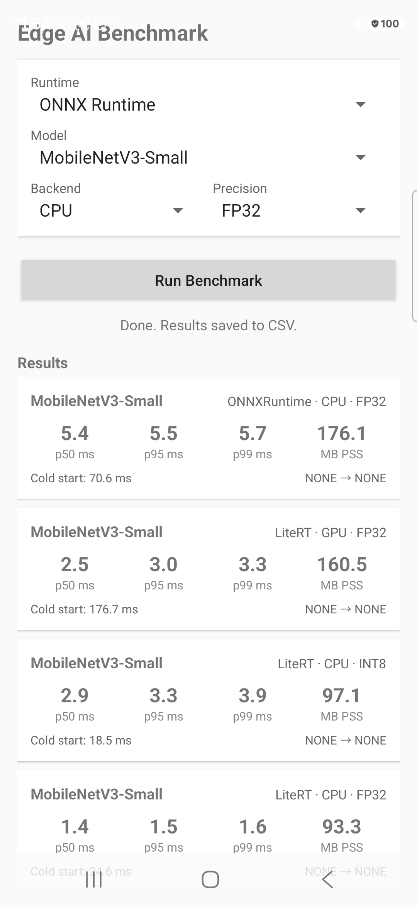

# Android AI Benchmark — On-Device Inference Runtime Comparison

> **Does GPU always beat CPU? Does INT8 always beat FP32?**  
> We measured it on a real device. The answers might surprise you.

[](https://developer.android.com)
[](https://kotlinlang.org)
[](LICENSE)
[](https://github.com/sangsoolee/android-edge-ai-benchmark-lab/actions)

---

<p align="center">
  
</p>

---

## What We Found (Galaxy S26 Ultra · Snapdragon 8 Gen 3)

### MobileNetV3-Small — All Runtimes

| Runtime | Backend | Precision | Model Size | p50 | p95 | p99 | Cold Start | Memory |
|---|---|---|---:|---:|---:|---:|---:|---:|
| **LiteRT** | **CPU (XNNPACK)** | **FP32** | 9.73 MB | **1.42 ms** ✅ | **1.49 ms** | **1.59 ms** | 22.2 ms | 93.5 MB |
| LiteRT | CPU (XNNPACK) | INT8 | 2.76 MB | 2.86 ms | 3.06 ms | 3.08 ms | 15.5 ms | 100.0 MB |
| LiteRT | GPU delegate | FP32 | 9.73 MB | 2.83 ms | 3.11 ms | 3.26 ms | 204.8 ms | 163.2 MB |
| ONNX Runtime | CPU | FP32 | 9.71 MB | 5.41 ms | 5.58 ms | 5.67 ms | 65.9 ms | 132.3 MB |

> Measurement: warmup=20, measured=100 runs · release build · airplane mode · no charging · 5-min cooldown

**Key findings:**
- 🏆 **LiteRT CPU FP32 wins** — Snapdragon 8 Gen 3 + XNNPACK delivers the best latency across all configurations
- ⚡ **LiteRT is 3.8× faster than ONNX Runtime** (1.42 ms vs 5.41 ms) — XNNPACK is highly ARM-optimized; ONNX Runtime uses a generic CPU path by default
- ⚠️ **GPU cold-start = 204 ms** — 9× slower than CPU due to shader compilation. Critical for first-launch UX
- ⚠️ **INT8 is 2× slower than FP32 on CPU** — dequantize ops cancel out compute savings on this chip
- 📦 **INT8 is 3.5× smaller on disk** (2.76 MB vs 9.73 MB) — only advantage is storage/download size

*Always benchmark on your target device. "GPU is faster" and "INT8 is faster" are not universal truths.*

---

## What This Project Is

A **reproducible benchmarking pipeline** for comparing on-device AI inference runtimes on real Android hardware.

Most "on-device AI" articles benchmark on a simulator, use a single average latency number, or don't disclose measurement conditions. This project measures **p50/p95/p99 latency, cold-start time, peak PSS memory, and thermal status** under fully controlled conditions — and makes all raw CSV data available.

**Runtimes compared:**

| Runtime | Status | Backends |
|---|---|---|
| [LiteRT / TFLite](https://ai.google.dev/edge/litert) 2.x | ✅ v0.1 | CPU (XNNPACK), GPU delegate |
| [ONNX Runtime Android](https://onnxruntime.ai) 1.x | ✅ v0.2 | CPU |
| [ExecuTorch](https://pytorch.org/executorch) | 🔜 v0.3 | CPU, XNNPACK |

---

## Reproducibility First

Every result in this repo can be reproduced by anyone with the same device. Measurement conditions are not just documented — they are enforced in code.

```
Warmup runs:      20 (discarded)
Measured runs:    100
Input:            Fixed synthetic tensor, same seed every run
Build type:       Release (never debug — interpreter overhead is significant)
ABI:              arm64-v8a only
Network:          Airplane mode ON
Screen:           50% brightness, fixed
Charging:         Cable disconnected
Cooldown:         5 min idle before each session
```

### Why p99?

p50 looks great on a chart. p99 is what your users actually experience on a bad thermal day.  
A runtime with `p50=12ms` but `p99=180ms` is not production-ready.

---

## How to Reproduce

### Step 1 — Python environment

```bash
cd android-edge-ai-benchmark-lab

python3 -m venv .venv-convert
source .venv-convert/bin/activate       # Windows: .venv-convert\Scripts\activate

pip install --upgrade pip setuptools wheel
pip install cmake ninja
pip install -r scripts/convert/requirements.txt
pip install tf-keras
```

> The conversion stack (`torch` + `tensorflow` + `onnx2tf`) has conflicting version constraints. A dedicated venv is required.

### Step 2 — Convert models

```bash
python scripts/convert/export_tflite.py --model mobilenet_v3_small --precision fp32
python scripts/convert/export_tflite.py --model mobilenet_v3_small --precision int8
```

### Step 3 — Push to device

```bash
adb shell mkdir -p /sdcard/Android/data/com.edgeai.benchmark/files/models
adb push models/ /sdcard/Android/data/com.edgeai.benchmark/files/models/
```

### Step 4 — Build & install

```bash
./gradlew assembleRelease
adb install -r app/build/outputs/apk/release/app-release.apk
```

### Step 5 — Run & pull results

Run the app → select runtime/model/backend/precision → **Run Benchmark**

```bash
adb pull /sdcard/Android/data/com.edgeai.benchmark/files/results/ ./results/raw/
```

### Step 6 — Analyze

```bash
python scripts/analyze/plot_results.py \
  --input results/raw/ \
  --output results/graphs/
```

---

## Project Structure

```
android-edge-ai-benchmark-lab/
├── app/src/main/kotlin/com/edgeai/benchmark/
│   ├── benchmark/        # BenchmarkEngine (abstract) + LiteRtEngine
│   ├── model/            # BenchmarkResult data class, Runtime/Backend/Precision enums
│   ├── ui/               # MainActivity, ResultsAdapter
│   └── util/             # ThermalMonitor, MemoryTracker, CsvExporter
├── scripts/
│   ├── convert/          # PyTorch → ONNX / TFLite / ExecuTorch
│   └── analyze/          # CSV → charts (matplotlib / seaborn)
├── results/
│   ├── raw/              # Raw CSV from device (git-ignored)
│   └── graphs/           # Generated charts (git-ignored)
└── docs/                 # Screenshots, write-ups
```

---

## Device Matrix

| Device | SoC | Android | Results |
|---|---|---|---|
| Samsung Galaxy S26 Ultra (SM-S948N) | Snapdragon 8 Gen 3 | Android 16 | ✅ [v0.1 data](results/raw/) |

---

## Roadmap

- [x] **v0.1** — LiteRT (CPU + GPU), MobileNetV3-Small, p50/p95/p99, CSV export
- [x] **v0.2** — ONNX Runtime CPU, LiteRT vs ONNX Runtime comparison (3.8× gap found)
- [ ] **v0.3** — ExecuTorch
- [ ] **v0.4** — INT8 accuracy drop analysis (FP32 vs INT8 top-1 accuracy)
- [ ] **v0.5** — YOLOv8n / YOLOv11n (preprocess / inference / postprocess split)
- [ ] **v1.0** — Multi-device matrix, technical blog series

---

## License

Apache License 2.0 — see [LICENSE](LICENSE)
